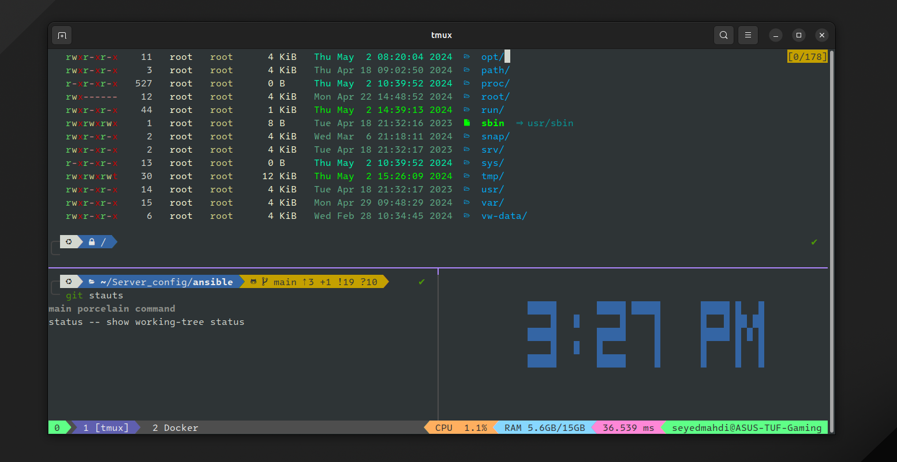

# Setting Up ZSH with Oh My ZSH

## Introduction

ZSH (Z Shell) is a powerful alternative to Bash, especially when coupled with Oh My ZSH, a community-driven framework for managing ZSH configurations. This guide will walk you through installing and configuring ZSH with Oh My ZSH, including the popular Powerlevel10k theme and essential plugins.


## Installation and Configuration Steps

### Step 1: Install ZSH

```bash
sudo apt install -y zsh
```

### Step 2: Change Default Shell to ZSH

```bash
chsh -s $(which zsh)
```

### Step 3: Install Oh My ZSH

```bash
sh -c "$(curl -fsSL https://raw.githubusercontent.com/ohmyzsh/ohmyzsh/master/tools/install.sh)"
```

### Step 4: Install Powerlevel10k Theme

```bash
git clone --depth=1 https://github.com/romkatv/powerlevel10k.git ${ZSH_CUSTOM:-$HOME/.oh-my-zsh/custom}/themes/powerlevel10k
```

### Step 5: Enable Powerlevel10k Theme

Open `~/.zshrc` and set:

```bash
ZSH_THEME="powerlevel10k/powerlevel10k"
```

### Step 6: Change Default Font to Nerd Font

Download and install the [IntoneMono Nerd Font](https://github.com/ryanoasis/nerd-fonts/releases/download/v3.2.1/IntelOneMono.zip) for better visual experience.

### Step 7: Configure Powerlevel10k

```bash
p10k configure
```

## Essential Plugins

Here are the top 5 ZSH plugins that enhance your shell experience:

1. **Autosuggestions**

```bash
git clone https://github.com/zsh-users/zsh-autosuggestions ${ZSH_CUSTOM:-~/.oh-my-zsh/custom}/plugins/zsh-autosuggestions
```

2. **Syntax Highlighting**

```bash
git clone https://github.com/zsh-users/zsh-syntax-highlighting.git ${ZSH_CUSTOM:-~/.oh-my-zsh/custom}/plugins/zsh-syntax-highlighting
```

3. **Fast Syntax Highlighting**

```bash
git clone https://github.com/zdharma-continuum/fast-syntax-highlighting ${ZSH_CUSTOM:=~/.oh-my-zsh/custom}/plugins/fast-syntax-highlighting
```

4. **ZSH Autocomplete**

```bash
git clone --depth 1 -- https://github.com/marlonrichert/zsh-autocomplete.git $ZSH_CUSTOM/plugins/zsh-autocomplete
```

To enable, add to `~/.zshrc`:

```bash
plugins=(git zsh-autosuggestions zsh-syntax-highlighting fast-syntax-highlighting zsh-autocomplete colored-man-pages)
```

Don't forget to:

```bash
source ~/.zshrc
```

## Customizing ls tool

### Install colorls

```bash
sudo apt install exa
```
Update `~/.zshrc`:
```bash
if [ -x "$(command -v exa)" ]; then
    alias ls="exa"
    alias la="exa --long --all --group"
fi
```

## Setting Up Tmux

### Step 1: Install Tmux

```bash
sudo apt install -y tmux
```

### Step 2: Install TPM (Tmux Plugin Manager)

```bash
git clone https://github.com/tmux-plugins/tpm ~/.tmux/plugins/tpm
```

### Step 3: Create ~/.tmux.conf file

Copy the provided configuration and save it as `~/.tmux.conf` , used the dracula theme 
```python
# Unbinds the default prefix Ctrl-b and sets it to Ctrl-Space for better usability.
unbind C-b
set -g prefix C-Space

# Enables mouse mode for easier navigation and interaction within TMUX.
set -g mouse on

# Sets the base index for windows and panes to 1, ensuring consistent numbering.
set -g base-index 1
set -g pane-base-index 1
set-window-option -g pane-base-index 1

# Automatically renumbers windows when one is closed.
set-option -g renumber-windows on

# Configures the Dracula theme with specific plugins and settings.
set -g @dracula-plugins "cpu-usage ram-usage network-ping ssh-session"
set -g @dracula-ping-server "google.com"
set -g @dracula-ping-rate 5
set -g @dracula-show-ssh-session-port true
set -g @dracula-border-contrast true
set -g @dracula-show-powerline true
set -g @dracula-show-left-icon session
set -g @dracula-show-empty-plugins false
set -g @dracula-left-icon-padding 0
set -g @dracula-network-ping-colors "pink dark_gray"

# Sets up plugins including Dracula theme, TPM (Tmux Plugin Manager), tmux-sensible, and tmux-yank.
set -g @plugin 'dracula/tmux'
set -g @plugin 'tmux-plugins/tpm'
set -g @plugin 'tmux-plugins/tmux-sensible'
set -g @plugin 'tmux-plugins/tmux-yank'

# Enables vi-mode for copy mode and customizes keybindings for selection and copying.
set-window-option -g mode-keys vi
bind-key -T copy-mode-vi v send-keys -X begin-selection
bind-key -T copy-mode-vi C-v send-keys -X rectangle-toggle
bind-key -T copy-mode-vi y send-keys -X copy-selection-and-cancel

# Installs TMUX plugins using TPM.
run '~/.tmux/plugins/tpm/tpm'

```

### Step 4: Source the Configuration

```bash
tmux source ~/.tmux.conf
```

### Step 5: Install Plugins

Press `Ctrl+Space + I` to install the plugins.

### Step 6: tmux autostart
You have to put these lines between your **plugins** and your **oh-my-zsh** source in `~/.zshrc` .
```bash
ZSH_TMUX_AUTOSTART=true
ZSH_TMUX_DEFAULT_SESSION_NAME=Working
```
## Conclusion

You've successfully set up ZSH with Oh My ZSH, configured Powerlevel10k theme, essential plugins, and Tmux. Enjoy your enhanced shell experience!


